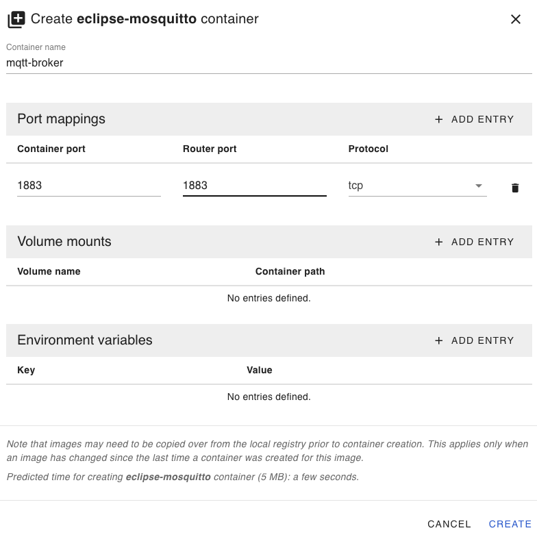
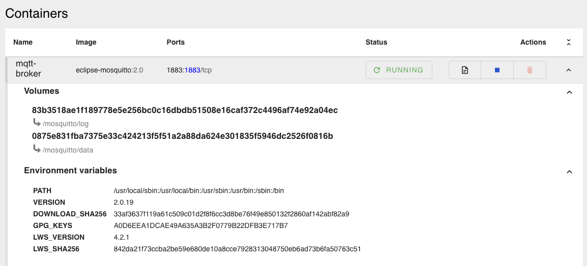

# Edge App - Mosquitto MQTT Broker

The **Edge App - Mosquitto MQTT Broker** for SecureEdge Pro provides a lightweight and reliable MQTT broker solution for secure and efficient message exchange between IoT devices. This application facilitates seamless communication between industrial devices and cloud platforms by acting as a central hub for message routing, enabling real-time data collection, remote monitoring, and control. It supports easy configuration, high scalability, and reliable messaging, making it an essential component for any IoT or industrial automation setup.

## Prerequisites

Ensure your environment is properly set up by following this guide: [Running custom Docker applications on the SecureEdge Pro](https://support.ixon.cloud/hc/en-us/articles/14231117531420-Running-custom-Docker-applications-on-the-SecureEdge-Pro).

## Steps to Deploy Mosquitto MQTT Broker

### 1. Build and Push the Docker Image

To build the Mosquitto image from the Dockerfile, ensure you have the correct builder:

For Unix-based systems:

```bash
./setup-buildx-env.sh
```

For Windows:

```cmd
setup-buildx-env.cmd
```

Run the build and push script:

For Unix-based systems:

```bash
./build_and_push_containers.sh
```

For Windows:

```cmd
build_and_push_containers.cmd
```

### 2. Set Up the MQTT Broker Container on SecureEdge Pro

- Access the local web interface of the SecureEdge Pro.
- Create a `mqtt-broker` container using the `mqtt-broker` image with the following port mappings:

  ```
  Port Mapping: 8883:8883 (Secure MQTT over SSL/TLS)
  Port Mapping: 1883:1883 (Plain MQTT)
  Port Mapping: 9001:9001 (MQTT over WebSockets)
  ```

- If enabling persistence, create a volume:

  ```
  Volume: mosquitto-data -> /mosquitto/data
  ```

Refer to the screenshot for configuration details:  


### 3. Start the Container

- Wait for the container to be created.
- Start the container.

Refer to the screenshot for details:  


## Configuration

The broker uses a simple configuration file (`mosquitto.conf`) that you can modify to suit your needs.

### Port Differences Explained

- **Port 1883 (Plain MQTT)**:

  - Used for MQTT communication without encryption.
  - Ideal for local network setups where security isn't a concern.

- **Port 8883 (Secure MQTT over SSL/TLS)**:

  - Provides encrypted communication using SSL/TLS.
  - Suitable for scenarios where secure data exchange is required, especially over public networks.

- **Port 9001 (MQTT over WebSockets)**:
  - Enables MQTT communication over WebSockets.
  - Commonly used for web-based MQTT clients or browser-based applications.

### Customization Options

- **Persistence**: Enable persistent storage for MQTT messages.
- **Authentication**: Use a username/password file for access control.
- **TLS/SSL**: Secure the broker with SSL encryption (see the mosquitto.conf for options).

## Certificate Generation

To secure the broker with SSL/TLS, you need to generate certificates. Follow these steps:

### Generate a Certificate Authority (CA)

```bash
openssl genrsa -out ca.key 4096

openssl req -x509 -new -nodes -key ca.key -sha256 -days 3650 -out ca.crt \
 -subj "/C=US/ST=State/L=City/O=Organization/OU=Unit/CN=MyCA"
```

### Generate Server Certificate Signed by CA

Ensure the subjectAltName includes the broker's IP (e.g., 192.168.140.1).

```bash
# Generate server private key
openssl genrsa -out server.key 4096

# Create server CSR with Subject Alternative Name (SAN)
openssl req -new -key server.key -out server.csr \
  -subj "/C=US/ST=State/L=City/O=Organization/OU=Unit/CN=192.168.140.1" \
  -addext "subjectAltName=IP:192.168.140.1"

# Sign server certificate with CA
openssl x509 -req -in server.csr -CA ca.crt -CAkey ca.key -CAcreateserial \
  -out server.crt -days 3650 -sha256 -extfile <(printf "subjectAltName=IP:192.168.140.1")
```

### Certificate Duration

The `-days` parameter in the OpenSSL commands determines the duration (validity period) of the certificates. In the above examples, the certificates are valid for **3650 days** (approximately 10 years). This duration can be adjusted based on your requirements:

- For shorter durations (e.g., 1 year): Replace `-days 3650` with `-days 365`.
- For longer durations, ensure that the certificates align with your security policies and the expected lifecycle of your MQTT deployment.

It is recommended to periodically review and renew certificates before they expire to maintain secure communication.

## Testing the Broker

### Subscribe to a Topic

To subscribe to an MQTT topic using mosquitto_sub:

```bash
mosquitto_sub -h <SecureEdge IP> -p 1883 -t 'test/topic'
```

Replace `<SecureEdge IP>` with the IP address of your device.

### Publish to a Topic

To publish a message to the MQTT broker:

```bash
mosquitto_pub -h <SecureEdge IP> -p 1883 -t 'test/topic' -m 'Hello from MQTT!'
```

## Optional: Enable Persistence

To enable message persistence across restarts, update the `mosquitto.conf` with the following lines:

```ini
persistence true
persistence_location /mosquitto/data/
```

When running the container, map a local directory for the persistent data:

```bash
docker run -d --name mqtt-broker -p 1883:1883 -p 9001:9001 -v /path/to/mosquitto/data:/mosquitto/data mqtt-broker
```

## Security (Optional)

You can secure the broker by enabling username/password authentication or TLS encryption. Here's a simple example of enabling basic authentication:

1. Create a password file:

```bash
mosquitto_passwd -c /path/to/passwordfile myuser
```

2. Update the configuration:

```ini
allow_anonymous false
password_file /mosquitto/config/passwordfile
```

For SSL/TLS encryption, add your certificates and update the `mosquitto.conf` file accordingly.

## Conclusion

Your Mosquitto MQTT broker is now running on the SecureEdge Pro and ready to handle MQTT messages. You can further customize the configuration to fit your security or performance needs.

For more advanced features, refer to the [Mosquitto Documentation](https://mosquitto.org/documentation/).
